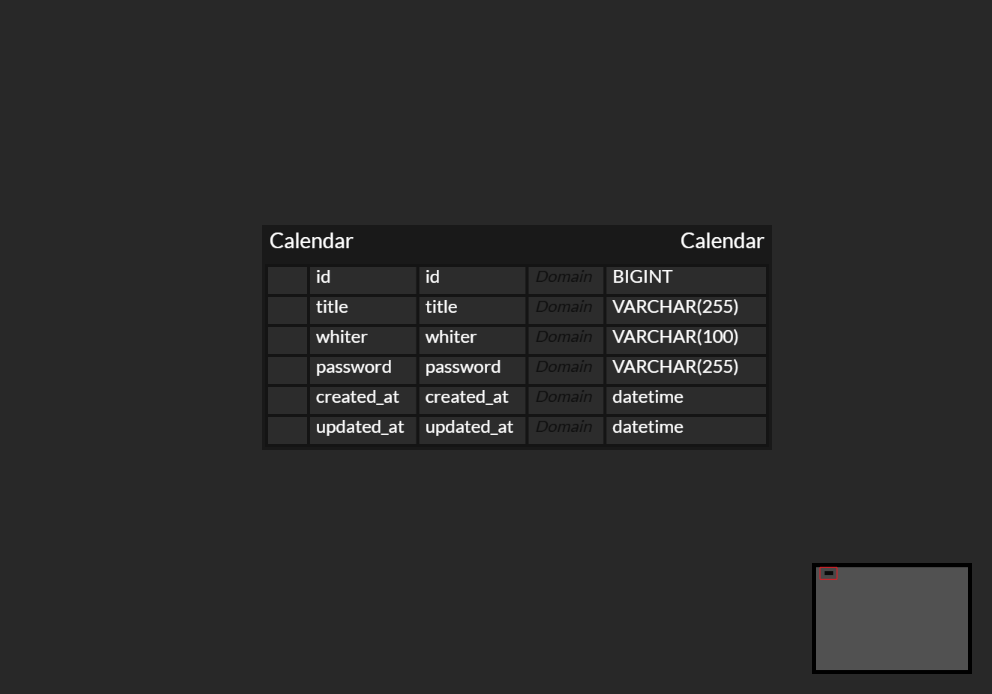

API 명세서
| **기능** | **Method** | **URL** | **Request** | **Response** | **상태코드** |
| --- | --- | --- | --- | --- | --- |
| 일정생성 | Post | /api/Calendar | 할일   작성자   비밀번호 | 할일   작성자   비밀번호   작성일   수정일 | 200: 정상등록 |
| 일정전체조회 | Get | /api/Calendar/{id} | 수정일   작성자명 | 수정일   작성자명 | 200: 정상조회 |
| 일정단일조회 | Get | /api/Calendar | ID | 할일 | 200: 정상조회 |
| 일정수정 | Put | /api/Calendar/{id} | 비밀번호 | 할일   작성자명 | 200: 정상수정 |
| 일정삭제 | Delete | /api/Calendar/{id} | 비밀번호 |  | 200: 정상삭제 |
ERD 작성
